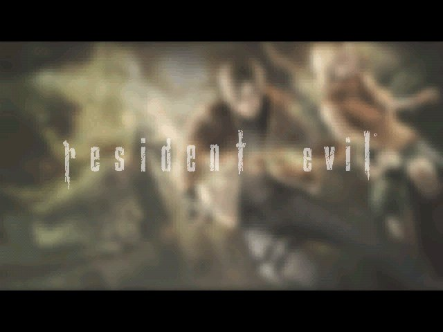

# RE4 Dreamcast

**An experimental Resident Evil 4 port for the Sega Dreamcast.**

A port of the GameCube game to the Dreamcast, built on a complete byte-identical decompilation of the
GameCube debug build. The recovered game code drives collision, enemy AI and event scripting;
preserving that behaviour is a requirement for port changes. Rendering, memory and loading were
rebuilt for the Dreamcast's 16 MB of RAM and its PowerVR graphics chip.

- **Dreamcast rendering:** a native PowerVR renderer, room worlds rebuilt from the PS2 version's
  lighter assets, and textures compressed to VQ.
- **Presentation:** cutscenes play as streamed movies with audio, alongside the in-game
  events, the HUD, radio calls, the Player's Manual and the chapter results screens.
- **Dreamcast hardware:** VMU saves, selectable frame pacing, and a GD-ROM image for GDEMU.

[Releases](https://github.com/lamb2k/re4dc/releases) · [Roadmap](port/dreamcast/docs/D367_THIRTY_FPS_ROUTE.md) ·
[Port notes](port/dreamcast/README.md) · [Decompilation](docs/DECOMPILATION.md)

## Status

Updated **2026-10-04**. The current local play build is **r21t**. Its source fixes are on
`dreamcast-port`; the latest downloadable GitHub prerelease is still
[r21m (2026-10-02)](https://github.com/lamb2k/re4dc/releases/tag/play-r21m-chapter1-2-20261002).
The r21t disc images have not been published as a GitHub release.

Since r21m, the play build includes SH-4 alignment fixes and an on-screen crash report, corrected
wall texture seams, faster texture loading, reduced reloading after radio calls, the cliff-movie
memory fix, and the approved character and mesh-rendering optimizations. **r21t fixes the inventory
case, items, menus and Leon preview**, and adds its missing texture package.

Checked in [Flycast](https://github.com/flyinghead/flycast) for r21t:

- The normal title / New Game sequence completes the opening movies and reaches r100 gameplay.
- A test build with the same play settings passes repeated inventory open/close checks in r100 and
  r104, restoring the saved game-memory area correctly.
- A separate test starting near the end of r106 reaches the chapter 1-1 results, saves to the VMU,
  enters r104 and reaches Continue after the scripted missed QTE.
- A matched gameplay trace passes for 1,804 r100 frames. This covers ordinary gameplay; inventory
  validation uses visual and memory-restore checks.

These are separate checks. **A continuous r21t title-to-chapter-end playthrough remains pending.**
The r21t GDEMU image has verified file contents and track layout; it has not been boot-tested in
Flycast or on a physical console. No new FPS improvement was measured for the inventory repair.
See the [build checklist](port/dreamcast/docs/D367_PLAY_BUILD_CHECKLIST.md) for source revisions,
test scope and earlier build history.

The staged play data covers the following route; it is not the full game:

| Chapter | Rooms | Verification scope |
| --- | --- | --- |
| 1-1 | intro, r100 forest, r101 village, r103 farm, r106 woods | Room and chapter-end/save checkpoints tested; continuous r21t playthrough pending |
| 1-2 | r104, r107, r105 | Route and chapter-end/save checkpoints tested in r21m; normal emblem/key-item pickups and a full r21t run remain unchecked |
| 1-3 | r105, r101, r102, r108, r109, r10a, r10b | Opening cutscene tested in earlier builds; the onward route remains unfinished |

The target remains **30 fps at full game speed on a real NTSC Dreamcast**. Flycast checks and hardware
estimates do not establish physical-console performance or compatibility.

## Backlog

1. Complete the continuous first-chapter playthrough, including combat, inventory, transitions and retry.
2. Fix remaining scene/model/effect rendering gaps and improve the slow combat and room views toward 30 fps.
3. Check normal chapter 1-2 emblem/key-item pickups and loading a save made inside r106.
4. Complete the chapter 1-3 route.
5. Qualify the current GDEMU image and complete the first physical Dreamcast test after the route checks.

## Known issues

- **Incomplete route and rendering coverage.** The onward chapter 1-3 route and some native scene/model/effect
  coverage remain unfinished. Some effect sprites are skipped when their textures cannot fit in video memory.
- **Untested pickups and saved-game reload.** Normal emblem and key-item pickups remain unchecked. A dedicated
  reload of a save made inside r106 is still needed. The earlier direct-start disc-open failure was fixed by
  serialized texture/disc reads; that test alone does not establish saved-game reload acceptance.
- **Performance is below target in demanding views.** Earlier r21m Flycast measurements with Fast pacing were
  about 12 fps / 80% game speed in the r101 fight, 12.5 fps / 84% in r106, 14 fps / 90-99% in r103, and 11 fps /
  74% in r105 after the chapter 1-3 opening. These are historical emulator figures, not r21t benchmarks or
  real-Dreamcast results. Fast pacing can look choppy; hold R and press START to cycle the pacing mode.
- **Room-entry pauses remain.** Texture packing reduced earlier measured Flycast entry loads to about 3 s;
  loading is still visible. Radio calls no longer require the earlier full room-texture reload in the tested case.
- **Cutscene playback can still drop frames.** The r104 arrival has shown dropped pictures. During the r21t
  chapter-end check, an early r104 world preload failed before the subsequent room-entry load succeeded.
- **Over-bright colours in r100.** Parts of the PS2 world, including the hedge by the gate after the radio call,
  remain flat and bright.
- **Physical hardware is untested.** r21m predates the SH-4 alignment fixes included in later local builds.
  The current r21t GDEMU package is content-verified, with console acceptance still pending.

## Playing

The latest downloadable build is [r21m](https://github.com/lamb2k/re4dc/releases/tag/play-r21m-chapter1-2-20261002).
It does not contain the later fixes listed above; r21t is currently a local test build. Follow each release's
notes for its packaged rooms and files. No BIOS is included; game data is not committed to this source repository.

- **Windows:** unzip `RE4DC-<build>.zip`, double-click `Play-<build>.cmd`.
- **Steam Deck / SteamOS:** extract `RE4DC-<build>-SteamOS.tar.gz` and run `play.sh`. It installs
  Flycast from Flathub if needed.
- **CachyOS / Arch:** extract `RE4DC-<build>-CachyOS.tar.gz`, run `./play.sh`.
- **Dreamcast with GDEMU (local test images):** copy `disc.gdi`, `track01.bin`, `track02.raw` and
  `track03.bin` into a new numbered folder on the SD card. The current image has not been tested on hardware.

| Action | Dreamcast pad |
| --- | --- |
| Move | Analog stick |
| Aim / fire | Hold R, press A |
| Action / talk / pick up | A |
| Run / cancel | B |
| Knife | L |
| Inventory | Y |
| Pause / options | START |
| Frame pacing (Smooth → Fast → Off) | Hold R, press START |

## Development

Rooms, characters and textures are rebuilt from the original data by offline tools, and each change is
reviewed on sheets like these before it lands. Rendering changes require a matching gameplay trace
against their reference build; each test report states its covered rooms and frames.

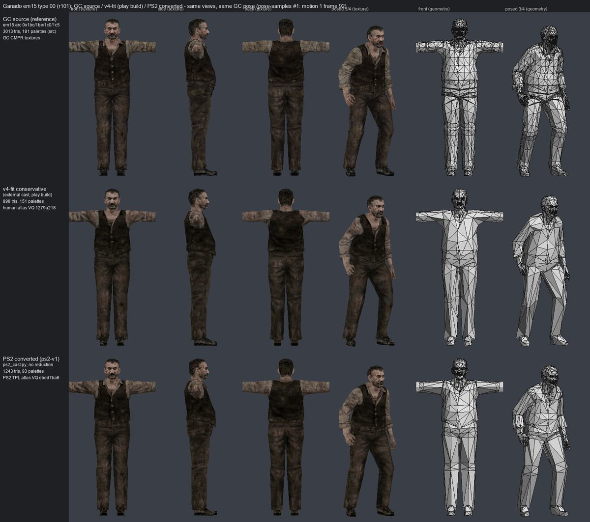
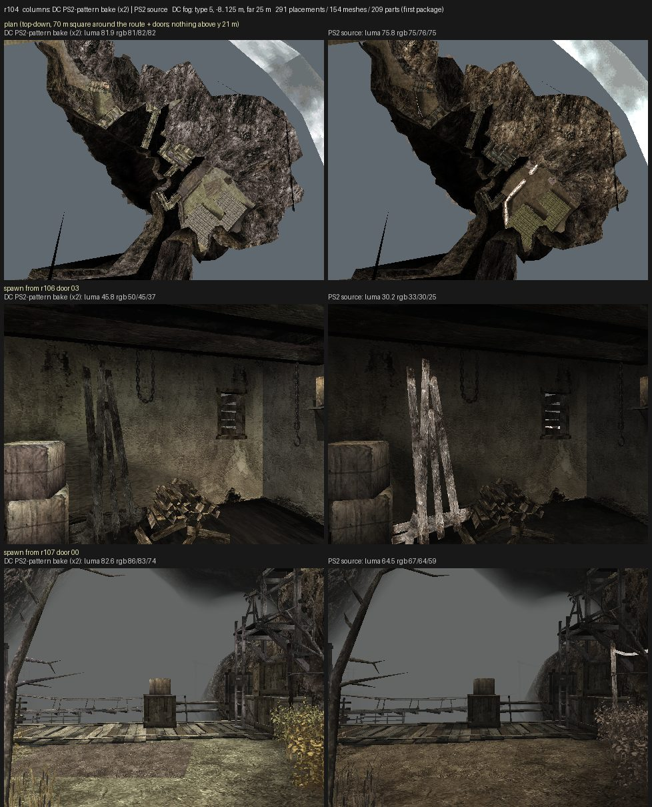

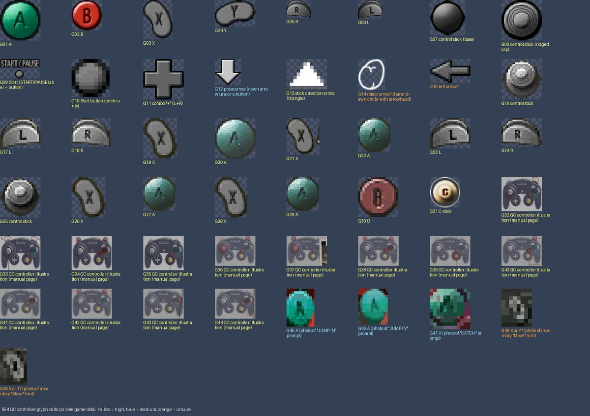
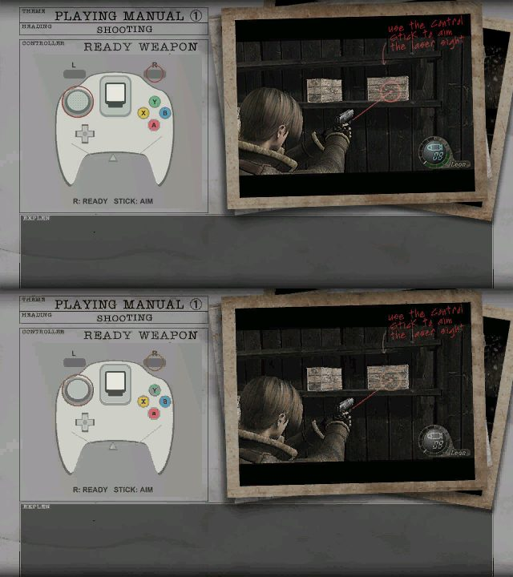

From left to right, top to bottom: a Ganado from the PS2 version prepared for the Dreamcast; the r104
world rebuilt from PS2 room data; the game's button-prompt glyphs, extracted for the native UI
renderer; a Player's Manual page, original texture against PowerVR VQ compression.

## Pictures

Captured in Flycast from the play builds.

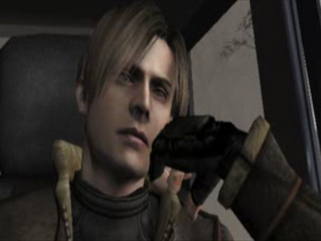 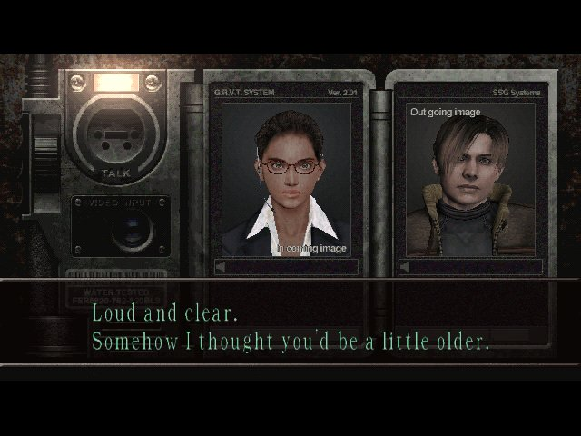 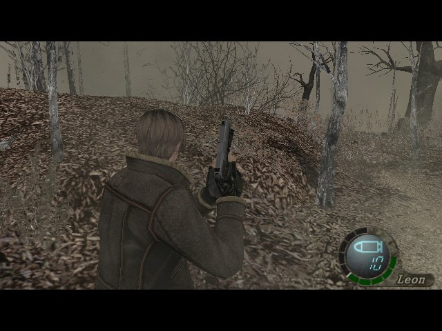
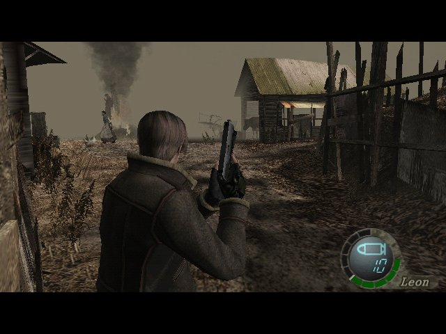 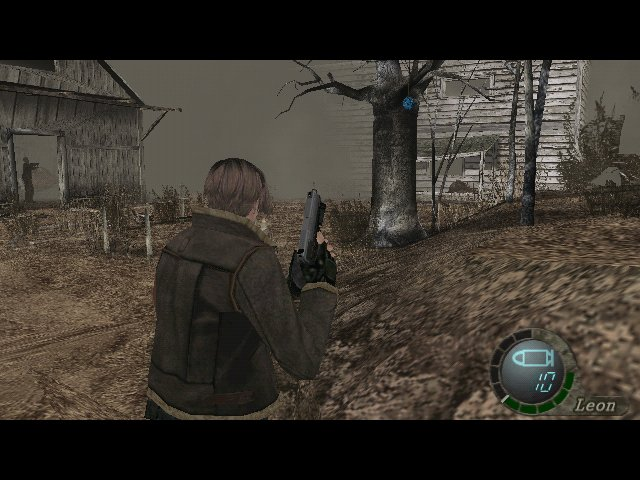 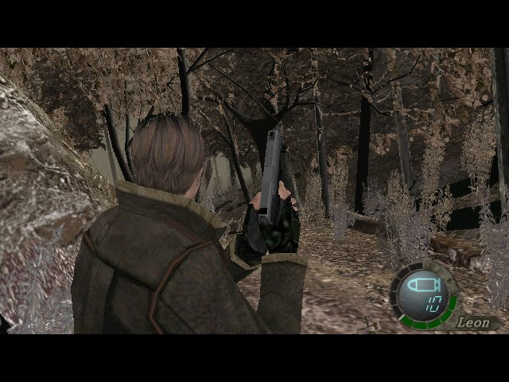
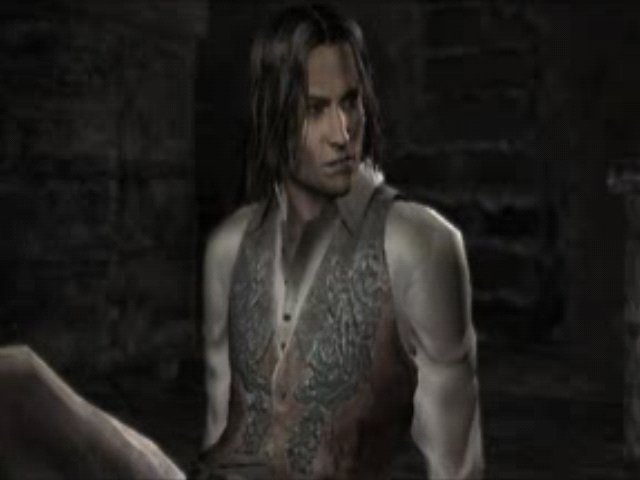 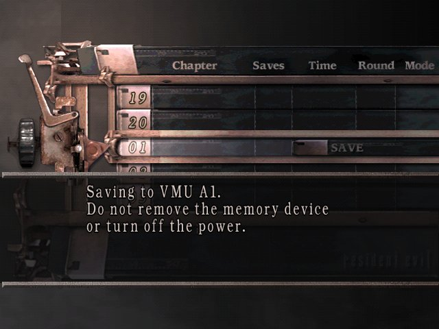 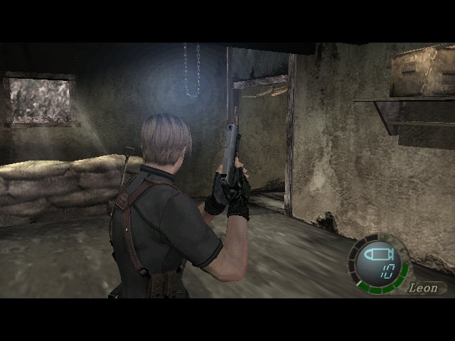
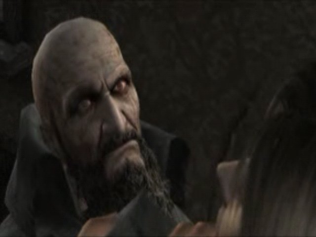 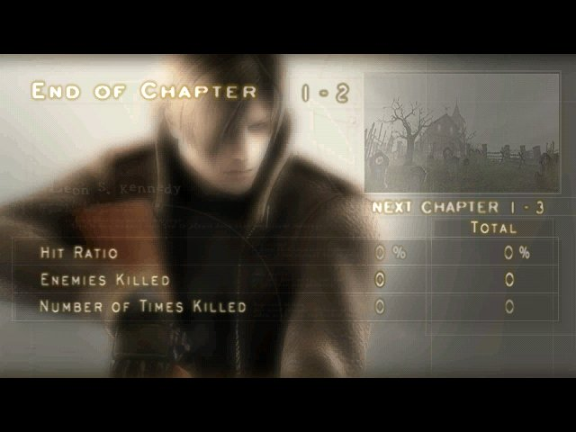

## How it works

The port keeps the GameCube game's code and replaces the platform underneath it.

- **Game code:** the decompiled C/C++ in `src/` builds for the Dreamcast's SH-4 CPU with KallistiOS. Rooms,
  enemies and weapons stay separate modules loaded per room, as on GameCube
  (`port/dreamcast/game/tools/gen_modules.py`). Collision, AI, events and game state are not changed.
- **Platform layer** (`port/dreamcast/game/platform/`): the GameCube graphics, sound, disc and memory-card
  calls go to Dreamcast versions. These are a PowerVR renderer (`native_ui.cpp`), VQ texture packages
  with a video-memory allocator (`vram_pages.cpp`), streamed cutscene movies (`native_movie.cpp`) and VMU saves.
- **Assets:** game data is never committed. Offline tools convert it from your own discs: room worlds
  from the PS2 version's data, textures to VQ, and cutscenes from the PS2 movies at 288×192 with audio.
- **Checking behaviour:** a logic trace records the game state every tick. A rendering or speed change
  must leave it identical to the reference build. Frame pacing skips drawing, never game ticks.

## Expanding the game

Paths are under `port/dreamcast/`.

| Task | Tool |
| --- | --- |
| Build the play image | `tools/d367/build-r21.sh` (flags in `docs/D367_PLAY_BUILD_CHECKLIST.md`) |
| Build and run a test image in Flycast | `tools/d367/route/route-build.sh`, `route-run.sh` (needs a local Flycast test harness) |
| Jump to a room or spot and set story flags | `tools/d367/warp.py` presets, in test builds (`DBG_WARP=1`) |
| Make test setups for a room | `tools/d367/route/make-route-fixtures.py` |
| See which rooms each chapter needs | `tools/d367/stage_route.py` |
| List what a room needs | `tools/d367/assets.sh discover <room>` |
| Room memory, sound banks, byte order | `tools/prepare_native_ui.py`, `tools/aica_banks.py`, `tools/le_mirror.py` |
| Room worlds from PS2 data | `tools/ps2_room_r4im.py` |
| Textures to VQ; missing textures from a run log | `tools/vq_native_ui.py`; `tools/d367/pairs_from_log.py` |
| Cutscene movies | `tools/convert_route_movies.py` |
| GDEMU image | `tools/d367/mkgdi.sh` |

Adding a room, in short:
1. Run `assets.sh discover` on it and read its entry in `docs/R4_FIRST_STAGE_GAP_AUDIT.md`.
2. Add its memory contract, sound banks and enemy modules.
3. Build its PS2 world, convert its cutscenes and hook them into the room's code.
4. Add a `warp.py` preset, run it in Flycast, and fix missing textures, halts and missing symbols.
5. Before merging, run the regression run: Leon must end up at exactly the same spot as on the
   previous build.

`docs/lanes/route.md` records how each room since r106 was brought up, including the traps found along
the way.

Start reading with:
- `docs/D367_THIRTY_FPS_ROUTE.md`: goals and decisions;
- `tools/d367/README.md`: build recipes;
- [docs/overview.md](docs/overview.md): a guide to the engine's code.

To contribute:
- branch from `dreamcast-port`, one change per pull request;
- include Flycast numbers from before and after the change;
- keep gameplay identical;
- never commit game data.

## Reporting bugs

Open an issue with the **Game bug** form ([Issues](https://github.com/lamb2k/re4dc/issues/new/choose)); any
GitHub account can file one. Check [Known issues](#known-issues) first. Please include:
- the exact build (e.g. public r21m or local r21t);
- where it happened (chapter and room, or what was on screen);
- what you did and what happened;
- whether it was Flycast (and on which system) or a real Dreamcast;
- a screenshot or video.

On Windows, also attach the newest file in the package's `logs\` folder. One bug per issue.

## Credits

Built on the RE4 GameCube decompilation ([docs/DECOMPILATION.md](docs/DECOMPILATION.md)),
[KallistiOS](https://github.com/KallistiOS/KallistiOS) and Flycast. Resident Evil is a trademark of
Capcom. This is an independent fan project for research and preservation, not affiliated with or
endorsed by Capcom, Sega or Nintendo. The game's code and data belong to their owners; the tools and
documentation written for this project are CC0 ([LICENSE](LICENSE)).
